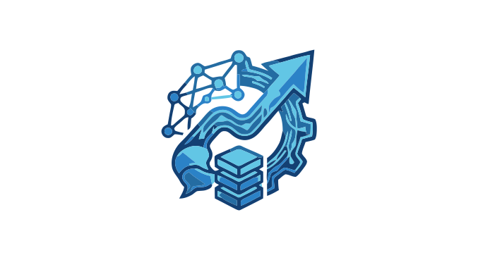
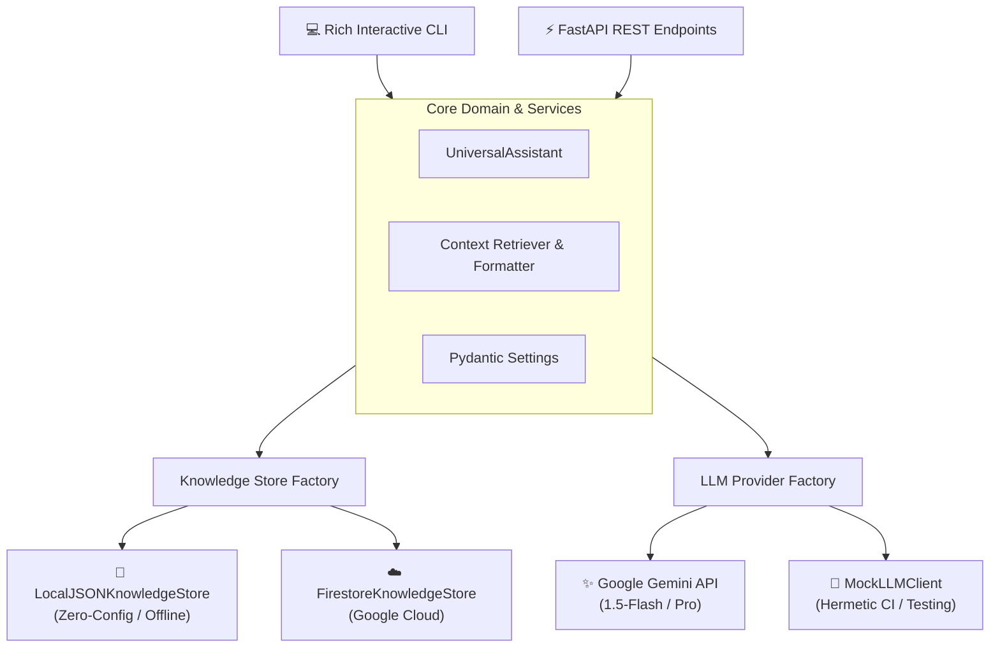

<p align="center">
  
</p>

# 🤖 Universal RAG Assistant Engine

[](https://github.com/Pacoaldev/Universal-RAG-assistant-engine/actions)
[](https://www.python.org/)
[](https://fastapi.tiangolo.com)
[](https://ai.google.dev/)
[](https://www.docker.com/)
[![Gentle AI](https://img.shields.io/github/v/release/Gentleman-Programming/gentle-ai?label=Gentle-AI&logo=data:image/png;base64,iVBORw0KGgoAAAANSUhEUgAAABUAAAAcCAYAAACOGPReAAAAAXNSR0IArs4c6QAAAARnQU1BAACxjwv8YQUAAAAJcEhZcwAADsMAAA7DAcdvqGQAAAWkSURBVEhLrZZZbFRVGMdPZ%2bnc2Zc7M%2ffOnZk7d6Z3OvveTmfrTGcYu1uKZbO0BUGBQqAsCmjBIWGLYi1GEWvdCImJIBhfjEtMNCaaGHnixWjE6JM%2b%2bWBMFAJ%2fMyUQOxKB4C85L%2bd83%2b%2bck%2fOdk0PIHdhBeE9j330xTWfHT7dP%2fDEbXf7VifCyZ18ODaw%2b1lJI1cfeJC7DckKUjTn%2fyTF9tvJqx8RffYkudHvTWOnNY6UjjkkhfXVrtPvrA20jv8z4ll4cJ1q6Mfe2zBjSsZOxkW8fTnWj4ghjM5%2fHXrYT2%2bk0xrh2xFkRLk7AxtQgTniH3mnM%2fxcnPAPH93mr10ejJbisTkz6KqgyQexmO7HbmMMWaxbb2Ry2cnnEGC8OxYbxvFC98IQ%2bkmx0kVUKRph1979xJDsKD%2btCVozCYbSijwuhohEwZo5jkzGJrYYUHqDceNrTgyLtxWhLFntCAzjhHTzb6CQzzuq5t3IbkIqloVCqEGfccGhpDNM%2bRCkbtrJ5TNlLmOAyWEvH0af1YJiJoGhtRUgM42h06S8zuqBpkfQZS3Hv4%2fFBxKIpUM0UVFI5sjoeEYrBiK0NAR2PhNqJoJbDkDmCMWsc65xtUMop%2bHxhbPZXcJqtBhZJzzt623e0VtCezMKsM0FKCCJqDnaVBYKGQdkgYhUdwR62iEl7ARssSTBEDplKhUowgwO%2bnktfOjKLS2yi2dM36ey41hloQ8QfhZJIYNAawautECkzMgY3EowXAYcXdsYJs1wLLZEg6PRhOtKP%2fVx2tu6pESJZENZKJdlj%2blD5IJeb3tmS%2f7UvWUDCE4JaTkEtVYCVamCgLWgRvBAFL8y0FZRUjoiRR587CZfahC2O7JV5ayG6aKX72Y5ATR0NX%2fAvoV9K9qxbH82h1x1HXs9DLVOAolSwGC0w6IywKLQoqF2Iax1QEAkcFideT47jRWd1aqMmZSZzqZT8LFkhrYtBSNPNSQ6L6e8DMg2CejvKrB8Zk2th5YomGVopCwwSBZQSGTgzt1BSp3xLz%2byxpx276PY15OyKG8KbPK4KspOEN77b8VD%2fc94iBKkK9fmclB55nRO6Jjn0pBkcZUDY6sEGdwHHxd73HiRq5pakps5aa7Z84foL3yk%2bahsLn%2fEODbztHhpAsNZ8bsmartdCfReHTAKUEiksEgqCVIOC3o7ljtDlTXz6s5fE%2fqM1YlNtMyTGn6Bz2gXpU6aMfY%2b7NNfrjv9Y4PzXylY%2fRrgE1tgSl44GHuj4MDlUnrQGzmX1tt8tEgViFP3D8UBp%2fNP4SO50sMr%2fY5NkShvxTZmS6251pGziN1YtDQ9lgV1Bg1PS6KV9OOjtWlsfTxgtR4IS3ZWTzR2Bfl3r3qOu4qvzHcMLxf6ku9i5yxRfsVOXMdXbLekjocwEp7egpHZj0tQOu0QDTZMCJT3%2f57lAb%2bLRWHtcoDSX12rEDW%2f7VnP1nL2%2b8voeT%2bzrZY7EJ%2fssCRHArYNe4KfRfcYqG%2fjdJNOCk%2brQ1mRFlXDgJTos0fEHAEhjZu5qxeZaRgiRZM3Cx1vsnSiZWrGKCXXts7Z5thFRsUha5ylH6ZUs7YFfxUIvVYNv0qCTMIg26c98MbiRLztbLtXj5loePFVWecBI9cgZXb%2f%2btnTK0OhaxGxqoGu1kJjPOcTzOcZ9fKVO2L9bET4yHcgWh13%2b90FKsnWa0PW4nEWXTsQk2zaPUk3WWJp3ZD7cG32I93%2bwjPEdfNggljoU5kvdVvHzaU%2f55JuuHqEx%2fq7A3Jw8Z%2bGvlaXMqcO2TPL6zi%2bVl4VRV2PcPXEkUYlGtczPgxJ20wVSDJwleb5GYvEVJNjcGHvXdOtcF9MS02ftxNgzTRIu8XanfC%2fk5MyheJPx%2fHYiDq4nvhvX8H4Y07e6K0pu8zHi%2fX9%2bKfVncEzR6l5PWBdI7cZrfpf8DeRY4wJrYaUrAAAAAElFTkSuQmCC)](https://github.com/Gentleman-Programming/gentle-ai)
[](https://opensource.org/licenses/MIT)

Motor de asistencia conversacional con arquitectura **RAG (Retrieval-Augmented Generation)** desacoplada, modular y lista para producción. Diseñado para adaptarse a **cualquier dominio o empresa** mediante configuración declarativa, con soporte de almacenamiento dual (Local JSON / Google Cloud Firestore) y doble interfaz de interacción (FastAPI REST y CLI enriquecido con Rich).

---

## 🏛️ Arquitectura del Sistema

El proyecto implementa principios de **Clean Architecture** e **Inyección de Dependencias**, separando estrictamente la lógica de dominio de los proveedores de LLM y motores de almacenamiento:



---

## ✨ Características Principales

- 🔄 **Desacoplamiento Total de Dominio**: Configurable para clínicas veterinarias, e-commerce, soporte técnico o mesas de ayuda cambiando únicamente un archivo JSON y variables de entorno.
- 🚀 **Almacenamiento Dual**:
  - **Modo Local (Default)**: Motor de búsqueda léxica y por relevancia en memoria sin dependencias externas ni costes cloud.
  - **Modo Firestore**: Conexión escalable con Google Cloud Firestore para entornos productivos.
- 🤖 **Proveedores LLM Flexibles**:
  - **Google Gemini**: Integración con modelos de última generación (`gemini-1.5-flash`).
  - **Mock LLM Provider**: Simulación offline determinista para pruebas unitarias herméticas y pipelines de CI/CD con coste cero.
- ⚡ **Doble Interfaz de Presentación**:
  - **FastAPI REST API**: Documentación interactiva OpenAPI/Swagger (`/docs`), chequeos de salud (`/health`) y métricas de latencia.
  - **Terminal CLI con Rich**: Renderizado con Markdown dinámico, tablas, spinners y comandos interactivos.
- 🐳 **Contenedorización y DevOps**: `Dockerfile` multi-stage seguro (non-root) y `docker-compose.yml` listos para desplegar.
- 🧪 **Testing y CI Automatizado**: Suite de pruebas con `pytest` y pipeline de GitHub Actions integrado.

---

## 🚀 Inicio Rápido

### 1. Clonar el Repositorio

```bash
git clone https://github.com/Pacoaldev/Universal-RAG-assistant-engine.git
cd Universal-RAG-assistant-engine
```

### 2. Crear Entorno Virtual e Instalar Dependencias

```bash
python -m venv venv

# Windows
.\venv\Scripts\activate
# Linux / macOS
source venv/bin/activate

pip install -r requirements.txt
```

### 3. Configurar Variables de Entorno

Copia la plantilla de entorno:

```bash
cp .env.example .env
```

Edita `.env` con tu clave de Gemini:
```env
GOOGLE_API_KEY=tu_api_key_aqui
LLM_PROVIDER=gemini
STORAGE_TYPE=local
```

*(Nota: Para probarlo inmediatamente sin API key, define `LLM_PROVIDER=mock`)*.

---

## 💻 Modos de Ejecución

### Opción A: Interfaz CLI Enriquecida

Inicia el asistente en la consola con renderizado Markdown y soporte interactivo:

```bash
python -m src.cli.main
# O directamente:
python chatbot.py
```

### Opción B: Servidor API REST (FastAPI)

Inicia el servidor uvicorn:

```bash
python -m src.api.app
```

Accede a la documentación interactiva en el navegador:
- **Swagger UI**: [http://localhost:8000/docs](http://localhost:8000/docs)
- **Health Check**: [http://localhost:8000/health](http://localhost:8000/health)

#### Ejemplo de consulta HTTP:

```bash
curl -X POST "http://localhost:8000/api/chat" \
     -H "Content-Type: application/json" \
     -d '{"query": "¿Cuáles son los horarios de atención y qué vacunas ofrecen?"}'
```

---

## 🐳 Ejecución con Docker

Levanta el servicio completo en un contenedor aislado con un solo comando:

```bash
docker-compose up --build
```

---

## 🎯 Adaptar a Cualquier Dominio (Universalidad)

Para adaptar el asistente a un nuevo negocio o contexto (por ejemplo, una tienda de tecnología):

1. **Edita o reemplaza la base de datos de conocimiento** (`knowledge_base.json`):
   ```json
   {
     "productos": [
       {"id": "laptop-01", "nombre": "MacBook Air", "precio": "1199€", "stock": 5}
     ],
     "politicas": [
       {"tema": "envios", "detalle": "Envíos gratuitos en 24h a toda la península."}
     ]
   }
   ```

2. **Ajusta las variables de entorno en `.env`**:
   ```env
   ASSISTANT_NAME="TechBot"
   ORGANIZATION_NAME="TechStore"
   KNOWLEDGE_BASE_PATH="knowledge_base.json"
   ```

---

## 🧪 Pruebas y Calidad de Código

Ejecuta la suite de pruebas unitarias herméticas (100% independientes de credenciales externas):

```bash
# Ejecutar tests
python -m pytest tests/ -v

# Validar linting y formato
ruff check .
```

---

## 📂 Estructura del Proyecto

```text
├── .github/workflows/ci.yml    # Pipeline CI de GitHub Actions
├── src/
│   ├── api/app.py              # Endpoints FastAPI y schemas Pydantic
│   ├── cli/main.py             # CLI interactivo con Rich
│   ├── core/
│   │   ├── assistant.py        # Motor RAG desacoplado
│   │   └── config.py           # Configuración tipada con Pydantic Settings
│   ├── llm/                    # Adaptadores LLM (Gemini, Mock, Factory)
│   └── storage/                # Adaptadores de datos (Local JSON, Firestore, Factory)
├── tests/                      # Suite de pruebas unitarias
├── Dockerfile                  # Dockerfile multi-stage de producción
├── docker-compose.yml          # Orquestación de contenedores
├── pyproject.toml              # Definición moderna del paquete Python
├── requirements.txt            # Dependencias fijadas
└── maskotas_knowledge_base.json # Base de conocimientos por defecto (Veterinaria)
```

---

## 📄 Licencia

[MIT](LICENSE.md) — Copyright (c) 2026 Pacoaldev

---

## 👤 Autor

**Paco López Alarte**
- **GitHub**: [@Pacoaldev](https://github.com/Pacoaldev) | **Email**: [pacoaldev@gmail.com](mailto:pacoaldev@gmail.com)

<a href="https://github.com/Gentleman-Programming/gentle-ai">
  
</a>
